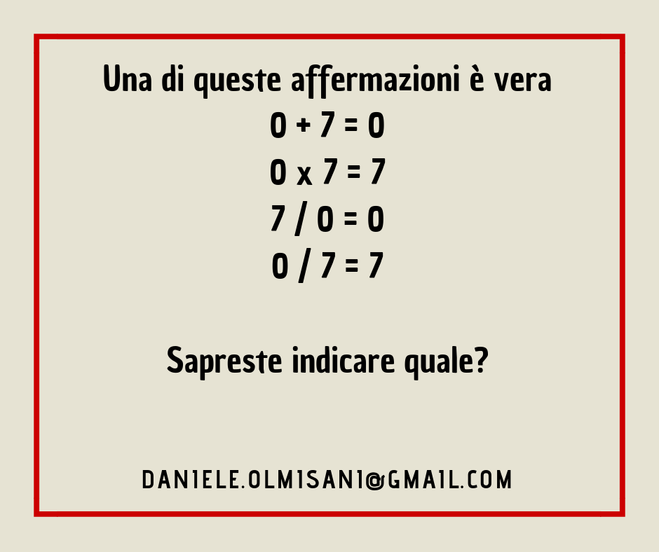

# Only for a Genius

*Il 95% di voi non sarà capace di dare la risposta corretta al seguente problema.*

Trovo molto spesso sul web (a dire il vero il più delle volte su Facebook) problemi pseudo-matematici che cercano di attirare click proponendo quesiti banali o che, al più, nascondono qualche noiosa ambiguità di notazione. Un po' poco soddisfacente per chi vuole sgranchirsi un po' la mente.

Questa pagina presenta qualche contributo che, spero, . 

## Episodio 01


## Episodio 02

Si tratta di trovare il numero che, logicamente, sia la continuzione della sequenza.


## Episodio 03

Quale numero non ha nulla in comune con gli altri?


## Episodio 04


## Episodio 05


## Episodio 06



## Episodio 07


# Le soluzioni

## Episodio 01

Si tratta di scomporre un numero in due fattori.
Tenendo conto dei soli numeri positivi, i valori cercati sono:

:pear: = 127

:apple: = 9721

Quindi la soluzione è **9.848**.

Il seguente programma è capace di scomporre il valore **N** in fattori primi:

```c++
#include <stdio.h>

int main() {
    int N = 1234567;
    for (int i=2; i<=N; i++) {
        while (N%i == 0) {
            printf("%d ", i);
            N /= i;
        }
    }
}
```


## Episodio 02

Il numero cercato è **363**.

Infatti le cifre di un numero in sequenza sono il conteggio delle lettere che descrivono la cifra corrispondente del numero che precede.
Esempio: **5 0 7** (cinque zero sette) -> **6 4 5**.

Ovviamente questa soluzione ha senso solo nella lingua italiana.

Da osservare che il numero tre e' l'unico punto fisso di questa trasformazione (i.e. F(3) = 3) e che tutte le cifre tenderanno a questo valore.

E' possibile verificare visivamente questa proprietà inserendo in un grafo orientato tutte le transizioni possibili.

```
digraph G {
    0 -> 4
    1 -> 3
    2 -> 3
    3 -> 3
    4 -> 7
    5 -> 6
    6 -> 3
    7 -> 5
    8 -> 4
    9 -> 4
}
```


## Episodio 03

Il numero cercato è **3754**.

Tutti gli altri numeri hanno 18 come somma delle loro cifre.


## Episodio 04

Il numero cercato è **1012**.
Sono delle semplici somme in base 3.


## Episodio 05

È la lettera **P**. 

Sono tutte le lettere dell'alfabeto che non hanno elementi di simmetria.

*Inserire diagramma di Venn*

## Soluzione Episodio 06

Tutte le espressioni matematiche sono corrette. Di conseguenza, l'affermazione falsa deve essere la prima (quella che non contiene simboli matematici) *[TBV ma allora non c'è contraddizione??]*

## Soluzione Episodio 07

Il numero cercato è **18**.
Ogni numero è il prodotto delli singole cifre del precendente.

Due osservazioni:
* tutte le sequenze che si possono costriure tramite questa regola finiscono con **0**
* la sequenza riportata nel problema è quella più lunga possibile (77 -- 49 --36 --18 -- 8 -- 0)

Entrambe le osservazioni si possono verificare facilmente tramite una rappresentazione grafica di tutte le sequenze possibili:


Il diagramma precedente è stato ottenuto tramite il programma GraphViz.

```
digraph G {
  0 -> 0
  1 -> 0
  2 -> 0
  3 -> 0
  4 -> 0
  5 -> 0
  6 -> 0
  7 -> 0
  8 -> 0
  9 -> 0
  10 -> 0
  11 -> 1
  12 -> 2
  13 -> 3
  14 -> 4
  15 -> 5
  16 -> 6
  17 -> 7
  18 -> 8
  19 -> 9
  20 -> 0
  21 -> 2
  22 -> 4
  23 -> 6
  24 -> 8
  25 -> 10
  26 -> 12
  27 -> 14
  28 -> 16
  29 -> 18
  30 -> 0
  31 -> 3
  32 -> 6
  33 -> 9
  34 -> 12
  35 -> 15
  36 -> 18
  37 -> 21
  38 -> 24
  39 -> 27
  40 -> 0
  41 -> 4
  42 -> 8
  43 -> 12
  44 -> 16
  45 -> 20
  46 -> 24
  47 -> 28
  48 -> 32
  49 -> 36
  50 -> 0
  51 -> 5
  52 -> 10
  53 -> 15
  54 -> 20
  55 -> 25
  56 -> 30
  57 -> 35
  58 -> 40
  59 -> 45
  60 -> 0
  61 -> 6
  62 -> 12
  63 -> 18
  64 -> 24
  65 -> 30
  66 -> 36
  67 -> 42
  68 -> 48
  69 -> 54
  70 -> 0
  71 -> 7
  72 -> 14
  73 -> 21
  74 -> 28
  75 -> 35
  76 -> 42
  77 -> 49
  78 -> 56
  79 -> 63
  80 -> 0
  81 -> 8
  82 -> 16
  83 -> 24
  84 -> 32
  85 -> 40
  86 -> 48
  87 -> 56
  88 -> 64
  89 -> 72
  90 -> 0
  91 -> 9
  92 -> 18
  93 -> 27
  94 -> 36
  95 -> 45
  96 -> 54
  97 -> 63
  98 -> 72
  99 -> 81
}
```

Il grafo è stato invece generato tramite il seguente programma in C/C++:

```

#include <cstdio>

int main() {

    printf("digraph G {\n");
    for (auto i=0; i<100; i++) {
        printf("  %d -> %d\n", i, (i/10)*(i%10));
    }
    printf("}");

    return 0;
}
```

